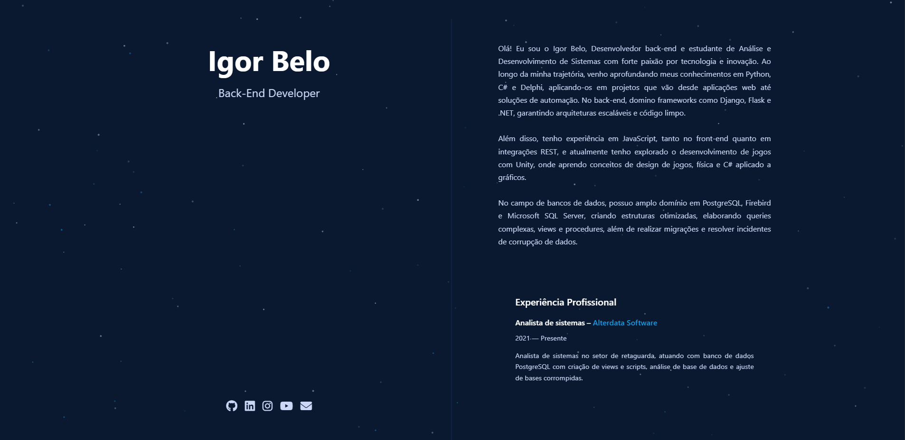

# 🌟 Portfólio Pessoal — Igor Belo

Este é o repositório do meu site de portfólio pessoal, desenvolvido para apresentar minhas habilidades, experiências e projetos de forma moderna e responsiva!

## ✨ Tecnologias Utilizadas

## 🎨 Funcionalidades

- 💻 Layout 100% responsivo (desktop, tablet e mobile).

- 🌌 Fundo animado com partículas.

- 🔥 Efeitos de hover nos ícones sociais.

- 👨‍💻 Apresentação de informações de forma limpa e intuitiva.

- 🌙 Tema escuro elegante.

- Apresentação topicos:
  - Sobre Mim
  - Experiência Profissional
  - Projetos desenvolvidos

## 🖼️ Preview do Site

## 📥 Como rodar o projeto localmente

Clone este repositório:

git clone https://github.com/igor-belo/portifolio_estatico

Entre na pasta do projeto:

cd nome-da-pasta

Abra o arquivo index.html no seu navegador. 🚀

Obs: Como ele é todo feito em HTML/CSS/JS puro, não precisa instalar nada para visualizar.

## 📬 Contato
Entre em contato comigo pelos links e vamos trocar uma ideia

&nbsp;&nbsp;&nbsp;

 
   
  
  
  

&nbsp;&nbsp;&nbsp;